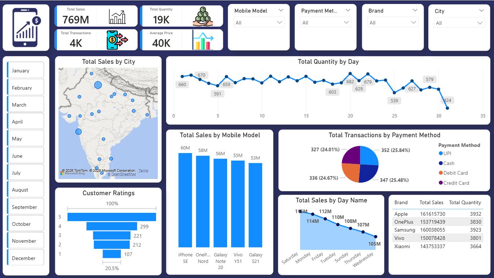

# 📱 Mobile Sales Dashboard — Power BI

---

## 📌 Problem Statement

Retail businesses selling mobile phones across multiple Indian cities often struggle to track **which products are selling, where, and through which payment methods**. Without a clear view of the data, it becomes hard to make good business decisions — like which brand to stock more, which city is underperforming, or which day of the week drives the most sales.

This project solves that problem by turning raw sales data into a clean, interactive dashboard.

---

## 🎯 Project Objective

To build an **interactive Power BI dashboard** that helps stakeholders:

- Track total sales, quantity sold, transactions, and average price at a glance
- Understand sales trends by city, brand, mobile model, day, and payment method
- Filter and drill down the data by month, brand, city, model, and payment method
- Identify top-performing products and underperforming segments

---

## 🗃️ Data Understanding

The dataset is an Excel file (`Mobile_Sales_Data.xlsx`) containing **one sheet** with mobile phone sales records across Indian cities.

| Column | Description |
|---|---|
| Transaction ID | Unique ID for each sale |
| Day | Day of the month |
| Month | Month number |
| Year | Year of sale |
| Day Name | Name of the weekday (e.g., Monday) |
| Brand | Mobile brand (Apple, Samsung, OnePlus, Vivo, Xiaomi) |
| Units Sold | Number of units sold in the transaction |
| Price Per Unit | Selling price per unit (in ₹) |
| Customer Name | Name of the buyer |
| Customer Age | Age of the buyer |
| City | City where the sale happened |
| Payment Method | UPI, Cash, Debit Card, or Credit Card |
| Customer Ratings | Customer rating (1 to 5 stars) |
| Mobile Model | Specific model name (e.g., iPhone SE, Galaxy Note 20) |

**Total Records:** ~4,000 transactions covering multiple Indian cities across 12 months.

---

## 🧹 Data Cleaning Process

The raw data had some inconsistencies that were fixed before building the dashboard:

- **Inconsistent Day Names** — Some rows had short forms like "Sat" or "Mon" instead of full names like "Saturday" or "Monday". These were standardized.
- **Decimal Precision Issues** — Price values had floating-point errors (e.g., `10174.700000000001`). These were rounded to 2 decimal places.
- **No Missing Values** — The dataset had no null or blank values, so no row removal was needed.
- **Data Type Check** — Ensured numeric columns (Units Sold, Price Per Unit, Ratings) were correctly formatted as numbers, and date-related columns were set properly.

---

## 🔗 Data Modelling

Since the data comes from a single flat Excel table, the data model is straightforward:

- One main table: **Mobile Sales Data**
- A **calculated column** was added to get **Total Sales per transaction**: `Total Sales = Units Sold × Price Per Unit`
- This single table powers all visuals in the dashboard — no relationships between multiple tables were needed

---

## 📐 DAX Measures

The following DAX measures were created to power the KPI cards and charts:

| Measure | Formula |
|---|---|
| Total Sales | `SUM(Total Sales column)` |
| Total Quantity | `SUM(Units Sold)` |
| Total Transactions | `COUNT(Transaction ID)` |
| Average Price | `AVERAGE(Price Per Unit)` |

These measures respond dynamically to all slicers (Brand, City, Month, Model, Payment Method).

---

## 📊 Dashboard Overview

The dashboard is built on a single page and contains the following visuals:

**KPI Cards (Top Row)**
- Total Sales → ₹769M
- Total Quantity → 19K units
- Total Transactions → 4K
- Average Price → ₹40K

**Charts and Visuals**
- **Map** — Total Sales by City across India
- **Line Chart** — Total Quantity by Day (day-of-month trend)
- **Bar Chart** — Top 5 Mobile Models by Total Sales
- **Pie Chart** — Total Transactions by Payment Method (UPI, Cash, Debit Card, Credit Card)
- **Bar Chart** — Customer Ratings distribution (1 to 5 stars)
- **Funnel Chart** — Total Sales by Day Name (Saturday to Wednesday)
- **Summary Table** — Brand-wise Total Sales and Total Quantity (Apple, OnePlus, Samsung, Vivo, Xiaomi)

**Filters / Slicers**
- Mobile Model
- Payment Method
- Brand
- City
- Month (January to December)

---

## 💡 Data Insights

1. **Apple leads in sales value** (₹161.6M) followed closely by Samsung (₹160M) and OnePlus (₹153.7M).
2. **iPhone SE is the top-selling model** by revenue (₹60M), followed by OnePlus Nord and Galaxy Note 20.
3. **Saturday drives the highest sales** (₹114M), while Wednesday records the lowest (₹105M).
4. **Payment methods are almost evenly split** — UPI (25.84%), Credit Card (25.48%), Debit Card (24.67%), and Cash (24.01%). No single method dominates.
5. **Customer ratings skew positive** — the majority of customers gave a 5-star rating, while only 107 transactions received a 1-star rating.
6. **Daily quantity fluctuates** between ~424 and ~682 units, with peaks mid-month and a noticeable dip near day 31 (end-of-month slowdown).

---

## ✅ Recommendations

1. **Invest more in Apple and Samsung inventory** — they consistently generate the highest revenue.
2. **Run weekend promotions** — Saturday is the strongest sales day; targeted offers can push it even higher.
3. **Don't neglect mid-week** — Wednesday and Thursday are the weakest days; flash sales or discounts on these days could balance the curve.
4. **Keep supporting all payment methods** — since customers are almost equally split across UPI, cards, and cash, removing any option could lose a segment of buyers.
5. **Follow up on low-rated transactions** — the 107 one-star and 212 two-star reviews need attention; understanding the reasons can improve customer retention.
6. **Explore underperforming cities** — the map shows many smaller cities with low sales volume. Targeted campaigns in those regions could unlock new growth.

---

## 🛠️ Skills Demonstrated

- **Data Cleaning** — Fixing inconsistencies in day names, price formatting, and data types
- **Data Modelling** — Setting up a clean single-table model with calculated columns
- **DAX** — Writing measures for KPIs that update dynamically with filters
- **Power BI Visuals** — Using maps, bar charts, line charts, pie charts, funnel charts, and tables effectively
- **Dashboard Design** — Organizing a clean, readable layout with slicers and KPI cards
- **Business Thinking** — Translating raw numbers into actionable insights

---

## 📂 Files in This Repository

| File | Description |
|---|---|
| `Mobile_Sales_Dashboard.pbix` | Power BI dashboard file (open with Power BI Desktop) |
| `Mobile_Sales_Data.xlsx` | Raw sales dataset used as the data source |
| `Preview/Dashboard.png` | Screenshot of the final dashboard |
| `Icons/` | Custom icons used in the KPI cards |
| `README.md` | This file |

---

## 🙏 Credits

- **Course:** 30 Days Power BI Micro Course
- **Instructor:** Sathish Dhawale
- **Platform:** [SkillCourse](https://skillcourse.in)

## 👤 Author

**Dhammadeep Anil Ramteke**

- 💼 LinkedIn: https://www.linkedin.com/in/dhammadeep-ramteke/
- 🐙 GitHub: https://github.com/DHAMMADEEPRAMTEKE30
- 📧 Email: ramtekedhamma30@gmail.com / dhammadeepramteke2702@gmail.com

---
